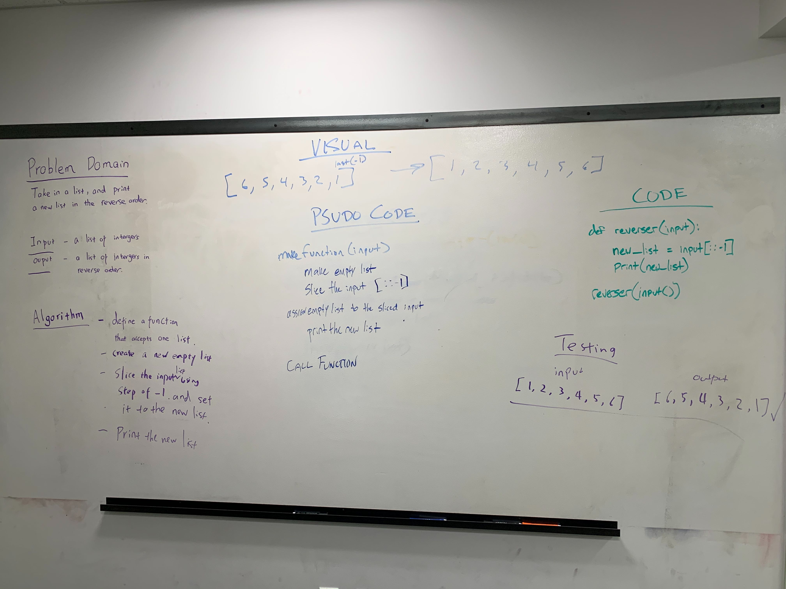

# Challenge Summary
reverseArray

## Challenge Description
Write a function called reverseArray which takes an array as an argument. Without utilizing any of the built-in methods available to your language, return an array with elements in reversed order.

## Approach & Efficiency
Using the slice function on a given array.
O(1) for big O time complexity
O(n) for big O space complexity

## White Board

