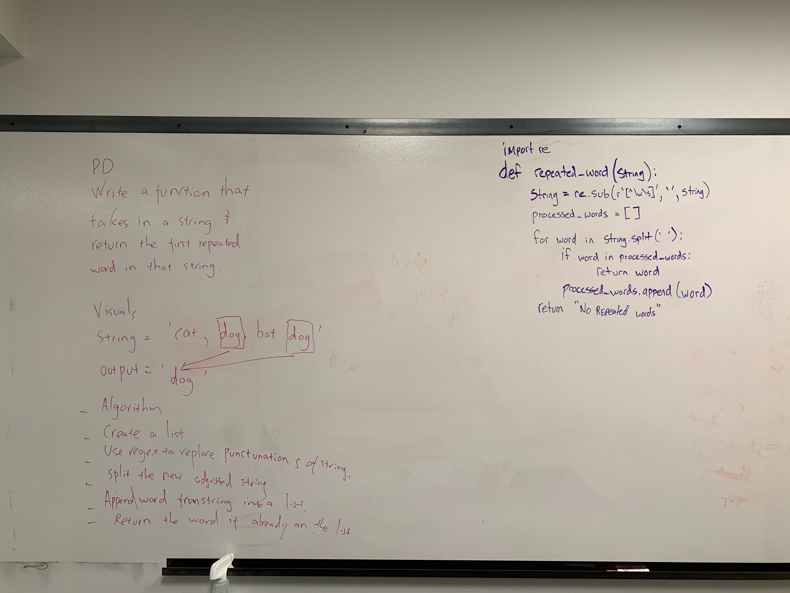

# Challenge Summary
Write a function that finds the first repreated word in a string.

## Challenge Description
Write a function that accepts a lengthy string parameter.
Without utilizing any of the built-in library methods available to your language, return the first word to occur more than once in that provided string.

## Approach & Efficiency
* repreated_word()
    * Big O speace O(1)
    * Big O time O(n)

## Solution

