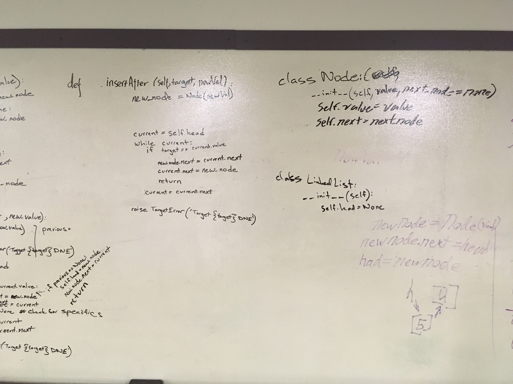
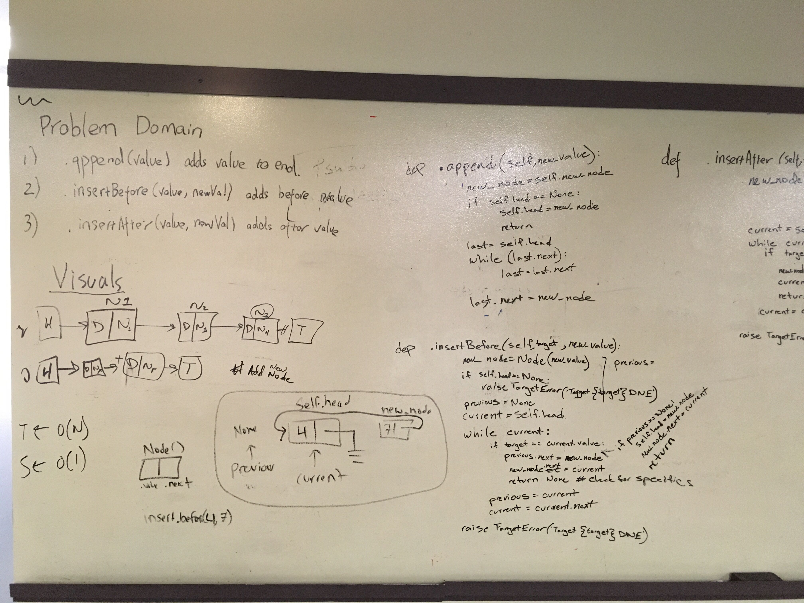

# Singly Linked List
Challenges that utlize linked list.

## Challenge Description
Create a Node class that has properties for the value stored in the Node, and a pointer to the next Node.
Within your LinkedList class, include a head property. Upon instantiation, an empty Linked List should be created.
Define a method called insert which takes any value as an argument and adds a new node with that value to the head of the list with an O(1) Time performance.
Define a method called includes which takes any value as an argument and returns a boolean result depending on whether that value exists as a Node’s value somewhere within the list.
Define a method called toString (or __str__ in Python) which takes in no arguments and returns a string representing all the values in the Linked List.
.append(value) which adds a new node with the given value to the end of the list
.insertBefore(value, newVal) which add a new node with the given newValue immediately before the first value node
.insertAfter(value, newVal) which add a new node with the given newValue immediately after the first value node

## Approach & Efficiency
Taking the insert method.
O(1) for big O time complexity.
O(1) for big O space complexity.

Taking the includes method.
O(n) for big O time complexity.
O(n) for big O space complexity.

Taking the to_string method.
O(n) for big O time complexity.
O(n) for big O space complexity.

Taking the append method.
O(n) for big O time complexity.
O(n) for big O space complexity.

Taking the insert_before method.
O(n) for big O time complexity.
O(n) for big O space complexity.

Taking the insert_after method.
O(n) for big O time complexity.
O(n) for big O space complexity.

Taking the kth_from_end method.
O(n) for big O time complexity.
O(n) for big O space complexity.

Taking the merge method.
O(n) for big O time complexity.
O(n) for big O space complexity.

## API
The LinkedList class has an attribute head. An insert method that adds a node to the beginning of the linked list. An includes method that looks for a node in the linked list. And a to_string method that returns a string representing all the values in the linked list. An append method that adds a node to the end of the linked list. An insert_before method that adds a new node before a given node. And an insert_after method that adds a new node after a given node. A kth_from_end method that returns the value of kth node from the end of the linked list. A merge method that zips two linked lists.

## Solution

